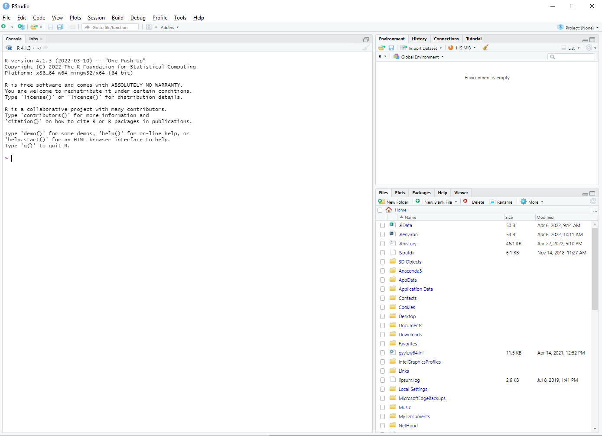
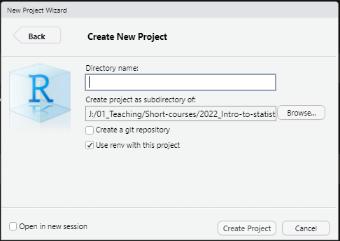

<!-- --- -->
<!-- title: "Pre-course material" -->
<!-- course: "Introduction to Statistics with R" -->
<!-- author: "Diego Aguilar-Ramirez" -->
<!-- date: "`r format(Sys.Date())`" -->
<!-- output: -->
<!--   pdf_document: -->
<!--     df_print: paged -->
<!--     toc: true -->
<!--     toc_depth: 2 -->
<!--     latex_engine: xelatex #Added this as pdflatex (default) could not process emoji unicode -->
<!-- --- -->


```{r setup, echo=FALSE, include=FALSE}
if (!require("pacman")) install.packages("pacman")
pacman::p_load(devtools)
if (!require("emo")) devtools::install_github("hadley/emo")
pacman::p_load(knitr,emo)
knitr::opts_chunk$set(echo = TRUE)
```

## Introduction  

**Welcome!**  

This practical will walk you through the set-up steps needed for
this course. This practical is considered **pre-course** material.  

In this pre-course practical you will instal **R** and **RStudio**. 
You will also learn about general tips on how to **organise** your data 
and files in preparation for data analyses. After this, you will be  
introduced to **R projects** and **R scripts**. Finally, you will also
learn about **R packages** and how to install them.  

***

# Install R and RStudio

## Permissions

Before installation, a note of advice: you should install **R** and **RStudio**
to a drive where you have read and write permissions. If not,
your ability to install **R packages** (see bellow) will be affected.  


## Instructions for Windows users

### To Install R

1. Go to [CRAN](https://cran.r-project.org/bin/windows/base/)  
2. Click on **Download R 4.2.0 for Windows** to download the self-installing executable to install R (version 4.2.0) from CRAN as `R-4.2.0-win.exe`  
3. Run `R-3.6.1-win.exe` choosing all the defaults on the install  
4. Now that **R** is installed, you need to download and install **RStudio**  

### To Install RStudio

1. Go to [RStudio](https://www.rstudio.com/products/rstudio/download/) and click on the **Download RStudio for Windows** button (`RStudio-2022.02.2-485.exe`)   
2. Run the `RStudio-2022.02.2-485.exe` file and follow the installation instructions  


## Instructions for Mac users

### To Install R

1. Go to [CRAN](https://cran.rstudio.com/bin/macosx/)   
2. Download the first `.pkg` link (`R-4.2.0.pkg`)  
3. Install the package by double-clicking on it and working through the prompts  
4. Now that **R** is installed, you need to download and install **RStudio**  

### To Install RStudio

1. Go to [RStudio](https://www.rstudio.com/products/rstudio/download/)  
2. Click on **macOS 10.15+**  (`RStudio-2022.02.2-485.dmg`)   
3. Save the `.dmg` file on your computer, double-click it to open, and then drag and drop it to your applications folder  

## RStudio

**RStudio** facilitates using **R** via a graphic interface. As described in [The Epidemiologist R Handbook](https://epirhandbook.com/en/r-basics.html#rstudio-orientation) 
"*You can think of R as being the engine of a vehicle, doing the crucial work,* 
*and RStudio as the body of the vehicle (with seats, accessories, etc.) that*
*helps you actually use the engine to move forward!*"  

**Open RStudio** (make sure it is **RStudio** and not **R**)  

```{r fig.link="https://epirhandbook.com/en/images/RStudio_overview.PNG", out.width="100%", fig.align='center', echo=FALSE}
knitr::include_graphics("img/RStudio_overview.png")
```

**RStudio** displays four rectangle mini-windows, called **panes**  

You will find out more about the panes further down in this page.  

***

# Organising data and files  

## Rationale  

**Organising** data and any other files required
for your analyses is the first step in data cleaning. Importantly, having
a clear and systematic approach to data cleaning in general, and organising
files in particular, is at the core of **reproducibility** and **open science**.   

An important part of organising your files involve how you name your files 
(data, scripts, plots, etc) and how you structure your folders, subfolders,
and the files within (aka the **directory tree**).  

### How to organise my files   
 
**Consistency** and **logic** are key! You want to make sure that your files 
are organised in such a way that you'll spend little to no time finding files
while working. This will in turn facilitate a faster and less error-prone
workflow. Aditionally, a clear directory tree structure will make things
easier for others when reproducing, reusing, or repurposing your work.  

```{r fig.link="https://libguides.princeton.edu/c.php?g=102546&p=930626", out.width="30%", fig.align='center', echo=FALSE}
knitr::include_graphics("img/FileStructure.png")
```

**For example:** all my `~/my_project/` folders tend to have my R scripts in the
root folder and have (at least) 3 sub-folders:  

- `~/my_project/data/`  
- `~/my_project/output/`  
- `~/my_project/manuscript/`

### How to name my files

A [clear nomenclature](https://datamanagement.hms.harvard.edu/collect/file-naming-conventions) 
for file names is essential to avoid errors.

General tips for a clear nomenclature include the following:  

- **No spaces**: it is simply easier to read, and prevents errors when 
reading files  
- **No special characters**: can also make errors happen (but `.`,`-` or `_` 
are useful instead of spaces)  
- **Self-descriptive**: in such a way that it is easy to identify what each
file contains (or does!)  
- **Embed logic**: if there is an order that scripts or files follow it is
good practice to add this to the name   

For example: consider a hypothetical research project that analyses data from
a survey in Mexico City that took place in 2015.  

The following **filename** uses no naming convention.    

`FINAL_script__clean-survey Mexico City 2015.R`  

While it describes what it contains, it does not necessarily reveal what it does. 
Additionally, as it is difficult to type and includes spaces, it is **error-prone**.
In fact, it looks worryingly similar to this:  

```{r fig.link="https://xkcd.com/1459", out.width="25%", fig.align='center', echo=FALSE}
knitr::include_graphics("img/filenames.png")
```

On the other hand, the following scripts implement the same data analyses
than the above file, but in a **step-wise** approach. Additionally, filenames 
describe the **order** in which the scripts should be run, which is informative
for the developer but also to ***others***. Finally, the appropriate
use of special characters faciliates reading while keeping the chance of
errors low.  

`01.1_merge-survey-data_MC-2015.R`    
`01.2_clean-survey-data_MC-2015.R`     
`02.1_main-analyses_MC-2015.R`    
`02.2_sens-analyses_MC-2015.R`    
`03.1_make-figures_MC-2015.R`   
`03.2_make-tables_MC-2015.R`    

> In summary, carefully considering how you structure and name your
files is good practice for data analysis.

***

## R Projects   

R Projects facilitate organising your project files and is a good habit to
catch-up on early on your R learning journey.  

As described in the Epidemiologist R Handbook, "[***R projects***](https://epirhandbook.com/en/r-projects.html)
*enable your work to be bundled in a portable, self-contained folder.* 
*Within the project, all the relevant scripts, data files, figures/outputs,*
*and history are stored in sub-folders and importantly - the* ***working directory***
*is the project's root folder.*"  

You can read more about R projects in [this section](https://r4ds.had.co.nz/workflow-projects.html) from the
R for Data Science textbook.  

**Let's create an R project**

### Create an R Project

From **RStudio**

```{r out.width="100%", fig.align='center', echo=F}

```

- Go to **File** > **New Project**...  
- Select **New Directory**  
- Then, select **New Project**  
- **Create New Project:**

```{r out.width="70%", fig.align='center', echo=F}

```

- Find a suitable parent directory to create your project in   
- For example, for this tutorial I have created a folder in the path `C:/path/to/file/2022_Intro-to-statistics`  
- For this practical, use `scripts` as **Directory name** (but note the name could be anything)
- If it appears, tick the **Use renv with this project** box  

You now have an RStudio project called **scripts**. On the background, RStudio created for you a folder called **scripts** in the directory you selected above (i.e. `C:/path/to/file/2022_Intro-to-statistics`).  

It also created a file called `scripts.Rproj` within this new folder (alongside with other very useful files you need not to worry about at the moment).  

You can find more information about RStudio projects [here](https://support.rstudio.com/hc/en-us/articles/200526207-Using-RStudio-Projects).  

***

## R Scripts

A script is a text-based file where you can collect the instructions
given to R to conduct your analyses and produce your results. This facilitates
keeping track of what you've done overtime and allows you to quickly re-do
previous work. Importantly, it also helps identifying errors and acting on them.  

Let's create an R script.  

Go to **File** > **New File** > **R Script**  

A new **pane** on the left hand side of the **RStudio** window should automatically appear. This is called the **source pane**. The tab on the top shows the name of the file, in this case the R Script you just created, which by default is called **Untitled1**.  

The **source pane** is effectively a basic text editor where you can type in your code in one (or multiple) script files.

Let's scribble a little note into our script that  gives us a hint about what this script is about.   

In **Untitled1** script you just created, type in:

``` {r}
# Pre-course material
# This is my first R script
```

**TIP**: The `#` sign is used to "comment out" annotations.
It is always good practice to leave notes to yourself (or to others) about 
what your scripts do.  

Now, let's save the script:

- Go to **File** > **Save As...**  (notice RStudio automatically opens the newly created folder `scripts`)  
- Save this script as `00.pre-course-practical.R`  

>***Listo!*** You now have created an R Project called **scripts**, which holds an R script called `00.pre-course-practical.R`.  

***

## Setup R packages

### What is an R package

R is great for multiple reasons. One of these reasons is its big community, which
is constantly expanding the applications and tools available for R users. These
tools are called packages (`r emo::ji("package")`) and they allow users to *call*
new functions which are then used for very specific (but powerful) tasks throughout
data processing and analysis. In these days, most of the R coders use several
packages for their work.  

You can read more about R packages [here](https://epirhandbook.com/en/r-basics.html#packages) in the 
Epi R Handbook (which will be referenced multiple times throughout the practicals).
There, you'll be able to find a comprehensive list of `r emo::ji("package")``r emo::ji("package")``r emo::ji("package")`
that are useful for epidemiological data analysis. This handbook is also a 
great source for self-paced learning of R for epidemiologists.  

### Installing R packages

We are going to install a number of packages that we will need later on. To
facilitate the installation process we are going to use a package whose main 
function is to help users install *other* packages `r emo::ji("exploding head")`. 
This package is called `pacman` (yes, R folk get very creative when naming their packages).  

Type in your R script the following (please feel free to copy-paste, to avoid typos):

```{r eval=F, message=F}
if (!require("pacman")) install.packages("pacman")
```

All this does is check if **pacman** is already installed. If not, then it installs
it. (Don't worry a lot about understanding what each bit is doing just now, this will
be covered further down on the course.)  

> Now run it!

> `r emo::ji("face screaming in fear")``r emo::ji("face screaming in fear")`
`r emo::ji("face screaming in fear")` ***How do I run something in R?!?*** 

Select the text you just typed into the script and either:  

- Press `Ctrl`+`Enter`, or  
- Click **Run** on the header of the **source pane**  

I prefer the `Ctrl`+`Enter` option.  

You will notice that text appears on the bottom left **pane**, in the **Console**
tab. The **console** is where R tells you what it's going on. There, you will find the output 
of operations that you have requested to R. Error messages also appear here. You can also
used R as a glorified calculator and type directly into the **console**. The result
of those calculations will appear there. Bear in mind that anything you do (i.e. type into)
the console will not be saved in your R script.

In this particular case, the console should let you know that **pacman** has
been installed successfully.  

After being downloaded and installed, packages need to be loaded on each session
before they can be used for analyses. **pacman** helps with this process by 
checking if any package in a given list is installed or not (and if it isn't, 
it then installs it), and then loading such packages.  

We will now use **pacman** to load the `r emo::ji("package")``r emo::ji("package")``r emo::ji("package")`
we will be using for this session.  

Run the following line:

```{r eval=F}
pacman::p_load(ggplot2) # The package "ggplot2" is a very famous for tool used for visualization in R
```

You'll find out more about useful packages throughout the practicals. However, 
one thing to bear in mind is that you only need to *load* these packages once
per R session. This means you need not to be constantly loading packages every
time you want to use them in your scripts.  

Now that we have installed and loaded **ggplot2** with the help of **pacman**
we can give it a try. Copy and paste the following code in your script:

```{r eval=F}
ggplot(iris, aes(Sepal.Length)) +
  geom_histogram() +
  theme_classic()
```
This code uses the dataset `iris` (pre-built into R) to make a **histogram**
of the Sepal Length (see description of `iris` [here](http://www.sthda.com/english/wiki/r-built-in-data-sets)).  

Now, run the code. You should see the following:  

```{r echo=F}
pacman::p_load(ggplot2)
g <- ggplot(iris, aes(Sepal.Length)) +
  geom_histogram() +
  theme_classic()

g
```

Loading and using the package **ggplot2** has allowed you to make a quick histogram.  

# Ending your R session

To finish this practical, let's go through some important steps.  

It is good practice to save the progress made on your script. 

Go to **File** > **Save**  

Or alternatively press `Ctrl` + `S`  

Close RStudio. You will be asked if you want to save your **Workspace**. This effectively
means that RStudio is going to create an image of your current variables (including datasets) and functions,
and save them to a file called `.RData`. When you re-open RStudio later on,
everything will look as it was when you last closed it. This function can seem
useful, especially when learning how to use R, but it is [largely advised **against**](https://www.r-bloggers.com/2017/04/using-r-dont-save-your-workspace/). This could
lead to bad habits such as having unregistered copies of data across several projects. It
also makes it easier to forget saving your scripts.  

While all the reasons above might not make a lot of sense now, they will do later on. The best approach is
to always save your R scripts and try to remember not relying on RStudio saving the Workspace.

***

# Summary

To recap, you installed **R** and **Rstudio**. You then created an **R project** where
you can keep all the scripts you will be using throughout this course. You also
created your first **R script**, called `00.pre-course-practical.R` which currently
looks like this:


```{r eval=F}
# Pre-course material
# This is my first R script

if (!require("pacman")) install.packages("pacman")

pacman::p_load(ggplot2) # The package "ggplot2" is a very famous for tool used for visualization in R

ggplot(iris, aes(Sepal.Length)) +
  geom_histogram() +
  theme_classic()
```

You then installed the package **pacman** and then, using this package,
you installed and *loaded* the package **ggplot2**. Finally,
you tried out **ggplot2** to make a histogram.  

