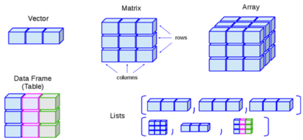

<!-- --- -->
<!-- title: "Practical 1 - Processing data" -->
<!-- author: "Diego Aguilar-Ramirez" -->
<!-- date: "`r format(Sys.Date())`" -->
<!-- output: -->
<!--   pdf_document: -->
<!--     df_print: paged -->
<!--     toc: true -->
<!--     toc_depth: 2 -->
<!--     latex_engine: xelatex #Added this as pdflatex (default) could not process emoji unicode -->
<!-- --- -->
<!-- --- -->
<!-- title: "Practical 1 - Processing data" -->
<!-- author: "Diego Aguilar-Ramirez" -->
<!-- date: "`r format(Sys.Date())`" -->
<!-- output: -->
<!--   html_document: -->
<!--     df_print: paged -->
<!--     theme: journal -->
<!--     toc: true -->
<!--     toc_float: true -->
<!--     toc_collapsed: true -->
<!--     toc_depth: 2 -->
<!--   pdf_document: default -->
<!-- --- -->


```{r setup, echo=FALSE, include=FALSE}
if (!require("pacman")) install.packages("pacman")
pacman::p_load(devtools)
if (!require("emo")) devtools::install_github("hadley/emo")
#pacman::p_load(tidyverse,here,rio,knitr,emo,skimr,ggplot2,janitor)
knitr::opts_chunk$set(echo = TRUE)
```

> **LEARNING OBJECTIVES**: In this practical, you will learn how to import your data into R. You will
also learn how to explore your data and understand what type of variables
are within the data set. Then, you will use basic tools for visualizing the distribution
of variables. Finally, you will be introduced to basic ways for creating and transforming
variables in R. A brief description of how to select variables is included at
the end of this practical.

Throughout this practical, you will be introduced to the following functions:  

| Topic | Function name |
|:---------|:-----------|
| Help in R | `help()`, `help.start()`  |
| Importing data | `read.csv()`, `getwd()` |
| Understanding & Exploring data | `dim()`, `nrow()`, `ncol()`, `head()`, `tail()`, `str()`, `class()` |
| Summarising data | `summary()`, `mean()`, `sd()`, `quantile()` |
| Distribution & outliers | `hist()`, `boxplot()` |
| Transforming data | `factor()`, `cut()`, `table()` |
| Selecting data | `data.frame()`, `subset()` |


> **NOTE** This is the first vertion of this teaching material. Please contact the author
to report mistakes and for general feedback at diego.aguilar-ramirez@ndph.ox.ac.uk

***

# Set up
## STEPS training data set
For this practical, we will be using the data set `WHO-STEPS-training.csv` which can be
downloaded from **Canvas**.

`WHO-STEPS-training.csv` is a modified version of the training data set 
used for the WHO-developed software **Epi Info**. It
contains data from **1289** participants of the [STEPS](https://www.who.int/teams/noncommunicable-diseases/surveillance/systems-tools/steps) survey, which collects data
on key risk factors for non-communicable diseases.  

`WHO-STEPS-training.csv` includes the following variables:  

```{r echo=F, message=F, warning=F}
pacman::p_load(rio,here)
steps.data <- import(here("data", "WHO-STEPS-training.csv"), na="") #In this data, missing values are in blank
desc <- c(
  "Gender (Women or Men)",
  "Age",
  "Current smokers (1=Yes, 2=No)",
  "Daily smokers (1=Yes, 2=No)",
  "Current alcohol drinkers (1=No, 2=Yes)",
  "Frequency of alcohol consumption (1=Daily, 2=5-6 days per week, 3=1-4 days per week, 4=1-3 days per month, 5=less than monthly)",
  "Last time BP measured (1=Past 12 months, 2=1-5 years ago, 3=Not in past 5 years)",
  "Height in cm",
  "Weight in kg",
  "SBP reading 1",
  "SBP reading 2",
  "SBP reading 3"
)
name <- c(
  "gender",
  "age",
  "curr_smkr",
  "daily_smkr",
  "curr_alc",
  "freq_alc",
  "bp_last_meas",
  "heigh_cm",
  "weight_kg",
  "sbp_1",
  "sbp_2",
  "sbp_3"
)
data.t <- data.frame(
  Name=name,
  Description=desc
)

```
```{r echo=F}
knitr::kable(data.t,
             caption = "List of variables in STEPS data set")
```

Please save this data set in your computer's **Desktop**, in a folder called 
**data**.  

The path to this file should look like this: `C:/User/Desktop/data/WHO-STEPS-training.csv`  

***

## Prepare your script for the practical

In the previous practical (pre-course material), you created an **R Project** 
and an **R script**.  

As mentioned in the lecture, it is important to keep track of all 
the data cleaning steps. The best way to do this is using a script, so 
let's create a new one for this practical.   

Open **RStudio** if it is not already open.

From **RStudio**, open your R Project:

1. File > Open Project...
2. Look for the directory where you saved your R Project (`.Rproj`) and click Open

Create a new R Script (you can use the short-cut `Ctrl`+`Shift`+`N`)   

Or go to File > New File > R Script   

Annotate the script:  
```{r eval=F}
# Practical 1: Processing data
# Author: 
# Date: 
```

Now save your script with a descriptive file-name. For example: `01.prac_data-proc.R`

## Help in R {.tabset .tabset-fade .tabset-pills} 

### Basic steps 

R includes extensive facilities for accessing documentation and searching for help. The `help()` function and `?` help operator in R provide access to the documentation pages for R functions, data sets, and other objects, both for packages in the standard R distribution and for contributed packages. Also, an HTML-based global help can be called with `help.start()`. You can also click directly on the help tab, located in the bottom right pane.  

***

> Remember to use help documentation regularly!  

***

### Other resources

Cheat sheets are a great resource for learners. RStudio as a bunch
available and you can find them [here](https://www.rstudio.com/resources/cheatsheets/).
[This one](http://github.com/rstudio/cheatsheets/blob/main/base-r.pdf) covers basic R functions and
[this one](https://raw.githubusercontent.com/rstudio/cheatsheets/main/rstudio-ide.pdf) is helpful to get your head around the RStudio IDE.  

***

> Remember to use help documentation regularly!  

***

# 1. Importing data 

> In this section, you will learn how to import your data set into R 

For this practical, we will place the training data set (`WHO-STEPS-training.csv`) within the R
project directory in a folder called `/data`.   

Before importing a data set, it is a good idea to have a clear expectation of what is 
included in the data. Usually, data sets come with data dictionaries that describe the 
contents of the data (see above for a minimalist example). You want to make sure you know approximately how many variables (columns)
and individuals/observations (rows) the data set should have. 

Importing extremely large data sets (thousands to millions of rows or columns) might 
need to be approached more carefully than shown here and could require large computing resources.  

**NOTE**: The decision to create copies of data sets and move these data into other directories 
largely depend on the standards of information governance and data security within institutions.  

## 1.1 Manually move the data file into the project directory and then import into R

### 1.1.1 Move dataset

1. Open your R Project directory `C:/path/to/file/2022_Intro-to-statistics` in your File Explorer  
2. Create a folder called `data`  
3. Save a new copy of the `WHO-STEPS-training.csv` data set in the newly-created folder `data`  

### 1.1.2 Import to R {.tabset .tabset-fade .tabset-pills}

#### Basic: using read.csv() 

```{r echo=F,eval=T}
steps.data <- read.csv(here("data", "WHO-STEPS-training.csv"), header = T, na.strings=c("")) #In this data, missing values are in blank
```

Use the following command to import the data set:
```{r eval=F}
steps.data <-    #Assign to the object steps.data
  read.csv( #What the read.csv function returns
    "C:/path/to/R-project/data/WHO-STEPS-training.csv", #Which is located here
    header = TRUE, # Keeping the first row as header for the names of columns
    na.strings=c("")) #And using blank spaces as missing
```

**NOTE**: If you are a Windows user, you will have to change `/` for `\\` when defining
the filepath.  

```{r eval=F}
"C:\\path\\to\\R-project\\data\\WHO-STEPS-training.csv"
```

If you are unsure of the exact directory to your R project use the following command:

```{r eval=F}
getwd() # Get working directory
```

Notice that because we are working within an R project, the working directory
is automatically set as the R project directory.  

You have now created an **object** called `steps.data` which contains the imported
data set.  

You are probably asking what an **object** is. When instructed to, R treats any datum or data that we want 
to temporarily hold on to (for instance, to use for analyses) as an
**object**.  

The way to instruct R to do this is with the assignment operator `<-` and in the form:

```{r eval=F}
x <- y
```

where `x` is the object being assigned whatever value `y` is.  

`y` can be many
things including a number, a string, a vector (of numbers or strings or both),
the result returned by a function, a matrix, or a table.

In this case, we are asking R to read the data set `WHO-STEPS-training.csv` and
assign it to an object called `steps.data` which will "live" in the 
R workspace (i.e. temporarily until the R session ends).  

Now that you have imported the data into R, you should be able
to see it on the Environment pane (top right). It should show that
`steps.data` has 1289 obs. of 26 variables.  

***

#### Advanced

In the **self-directed learning** (SDL) section you can find out how to import data using the 
packages **rio** and **here**.

***

###

> Now were are ready to explore our data!

***

# 2. Understanding & Exploring data

## 2.1 How does R understand data

Often, epidemiological data comes from **multiple sources**:  

- Questionnaire data from recruitment  
- Biological sample results  
- Linkage to clinical/mortality records 
  
How do data usually look like in `R`?

**R** is an object-oriented language where **objects** are anything
(constants, data structures, functions, graphs) that can be assigned
to a variable  

```{r out.width="100%", fig.align='center', fig.link="http://venus.ifca.unican.es/Rintro/dataStruct.html",echo=F}

```

As described in the [Epidemiologist R Handbook](https://epirhandbook.com/en/r-basics.html#object-structure), "*in epidemiology, data sets are usually in the format of a* ***data frame*** *, where rows are individuals and columns are variables with different measurements for each individual.* This is the data structure that will be most
relevant for this course insofar as it most simply depicts **"the data"**.  

However, **vectors** are also commonly used throughout R coding and most of the
functions used for statistical models output their results as **lists**. Therefore,
mastering the use of other data formats besides the **data frame** is
important in order to take full advantage of R.  

## 2.2 Exploring the data {.tabset .tabset-fade .tabset-pills}

There are multiple commands or functions in R that are useful to have
a glimpse at your data. Use combinations of the following functions
to understand the contents of the data set.

```{r echo=F}
#steps.data <- import(here("data", "WHO-STEPS-training.csv"))
```
Use `dim()` to obtain the dimensions of the data frame (number of
rows and number of columns). The output is a vector.  
```{r}
dim(steps.data)
```
Use `nrow()` and `ncol()` to get the number of rows and number of columns, respectively.  You can get the same information by extracting the first and second element of the output vector from `dim()`.
```{r}
nrow(steps.data)
ncol(steps.data)
```
Notice how
```{r}
dim(steps.data)[1]
```

Returns the same as

```{r}
nrow(steps.data)
```

And how

```{r}
dim(steps.data)[2]
```

Returns the same as 

```{r}
ncol(steps.data)
```

Use `head()` to obtain the first $n$ observations and `tail()` to obtain the last $n$ observations; by default, $n$ = 6.  These are good commands for obtaining an intuitive idea of what the data look like without revealing the entire data set, which could have millions of rows and thousands of columns.

```{r}
head(steps.data,n=5)
```

```{r}
tail(steps.data,n=5)
```

### Question 2.2.1 

**Use the `str()` function to see the structure of the data. Are the descriptions of the variables what you expect?**

```{r eval=F}
str(steps.data)
```

***

### Answer 

The output shows unexpected format or "class" for some of the columns.  

```{r echo=F}
str(steps.data)
```

For example, `gender` should not be a `chr` (character or string variable) but a category (called **factor** in R). Similarly,
`curr_smkr` should not be an `int` but a factor.  

***

### Define class of columns

**Before moving forward, some formatting needs to be done.**  

Copy and paste into your script and then run this chunk of code that 
changes the class of each of the variables.  


```{r echo=T}
# Data needs reformatting
steps.data[steps.data==""] <- NA # Define "" as missing in case it was not done when importing
steps.data$gender       <- as.factor(steps.data$gender)       # Defines gender as factor
steps.data$curr_smkr    <- as.factor(steps.data$curr_smkr)    # Defines curr_smkr as factor
steps.data$daily_smkr   <- as.factor(steps.data$daily_smkr)   # Defines daily_smkr as factor
steps.data$curr_alc     <- as.factor(steps.data$curr_alc)     # Defines curr_alc as factor
steps.data$freq_alc     <- as.factor(steps.data$freq_alc)     # Defines freq_alc as factor
steps.data$bp_last_meas <- as.factor(steps.data$bp_last_meas) # Defines bp_last_meas as factor
steps.data$sbp_1        <- as.numeric(steps.data$sbp_1)       # Defines sbp_1 as numeric
steps.data$sbp_2        <- as.numeric(steps.data$sbp_2)       # Defines sbp_2 as numeric
steps.data$sbp_3        <- as.numeric(steps.data$sbp_3)       # Defines sbp_3 as numeric
```

**NOTE**: Do not worry if you are not entirely sure what this code did. 
You will understand much better what each of these lines do by the end of the practical.)

**Now, let's use the function `str()` again:**  

```{r}
str(steps.data)
```

In this corrected example, `num` denotes that the **column** (variable) is numeric continuous, `int` that it is an numeric integer, and `Factor` that it is an ordered category. As mentioned in the lecture, it is really important
to make sure that the data is formatted correctly and that R understands the type of variable it is going to be working with.    

In R data format is also called **class**. You can find out the class of each row (or, in fact, of any R object) using the function `class()`. You will use it again later in this practical. You can find more information about object classes [here](https://epirhandbook.com/en/r-basics.html#object-classes).      

***

## 2.3 Summarising data

Summarising data can help draw out patterns.

### 2.3.1 Generate basic data descriptive statistics {.tabset .tabset-fade .tabset-pills}

When applied to a data frame, the `summary()` function returns summary statistics for all columns, according to the class of each column.  

```{r}
summary(steps.data)
```

You can also summarise a single variable using
```{r}
summary(steps.data$sbp_1)
```

#### Question 2.3.1 

**Complete the table bellow.**  

**HINT**: use the functions `summary()`, `mean()`, `sd()`, and `quantile()`  

|        |sbp_1 |age |height_cm |weight_kg |
|:-------|:-----|:---|:---------|:---------|
|mean    |      |    |          |          |
|median  |      |    |          |          |
|SD      |      |    |          |          |
|range   |      |    |          |          |
|NA's    |      |    |          |          |

**TIP**: If a variable has missing values `NA`, functions such as `mean()` or `sd()` will yield missing values (i.e. the result will show `NA`). The option `na.rm` (i.e., remove `NAs`) indicates whether `NA` values should be stripped before the calculation proceeds.  
Example:  
```{r}
mean(steps.data$height_cm)
```

```{r}
mean(steps.data$height_cm, na.rm=TRUE) # na.rm removes NAs (missings)
```

Now, complete the table.  

***

#### Answer to question 2.3.1

This is how the table should look like

|        |sbp_1 |age |height_cm |weight_kg |
|:-------|:-----|:---|:---------|:---------|
|mean    |139.6 |44.3|168.8     |93.7      |
|median  |137   |44  |169       |91        |
|SD      |22.8  |11.2|8.9       |22.3      |
|range   |58-237|0-65|78-201    |39-232    |
|NA's    |89    |6   |88        |88        |


***

#### Other options

The package `skimr` takes one-liner summary statistics to the next level. Its function `skim()` 
provides a wealth of information about the data set including summary statistics as well as information
about missing data and presents it in a slightly different way to the basic R functions. 

An example is available in the self-directed learning section.  

***

## 2.4 Distributions and outliers 

### {.tabset .tabset-fade .tabset-pills}

As mentioned in the lecture, it is always a good idea to look
at the distributions of variables to understand the data better
and to identify implausible values and outliers  

#### Question 2.4.1

**Plot a histogram of `height_cm` and describe the distribution.**  

**HINT**: look at the histogram but also check the mean
and median

Use the following code:  

```{r eval=F}
hist(steps.data$height_cm)
```

***

#### Answer

The code suggested (with a few more options) displays
a histogram of height.  

```{r}
hist(steps.data$height_cm,
     main="Histogram of height",
     xlab="Height in cm")
```

It seems **height** is normally-distributed but it is hard to tell.  

Let's increase the number of breaks.    

```{r}
hist(steps.data$height_cm,
     main="Histogram of height",
     xlab="Height in cm",
     breaks = 50)
```

This is much more informative. 

***

#### Detailed interpratation

If you are unsure on skewness, remember to use the summary statistics.

Rules of thumb:

- If median = mean, it is usually normally distributed
- If data are right-skewed, mean is bigger than median
- If data are left-skewed, mean is smaller than median

In a histogram, the height of the bars on the vertical axis needs to be proportional to the probability distribution of that continuous variable (this depicts the parts of the range that have more data points). If the class (i.e. bins) widths are equal, then a frequency histogram can be used. However, if the class widths are unequal (for example, if height is truncated at 200+), then the height of the bars in a frequency histogram will misrepresent the probability distribution. With non-uniform bin size, histograms constructed with densities help maintain an accurate visualisation of the data distribution.  

***

### {.tabset .tabset-fade .tabset-pills}

An important step of data exploration is to identify **outliers**, which are observations that are substantially outside the range of the majority of the data. Outliers may be the result of **measurement error**, i.e. if the values were recorded incorrectly, although sometimes they may result from extreme cases (which are often seen in small data sets). How far does a value have to be outside the main distribution to be considered an outlier? There are no concrete rules, and often it is a **judgement call** depending on how much they are likely to influence your analyses. Inspecting the distributions graphically first can provide insight into odd values. 

#### Question 2.4.2

**Make a boxplot of height**  

**HINT**: The function is called `boxplot()`

***

#### Answer

```{r}
boxplot(steps.data$height_cm, 
        main="Boxplot of height",
        ylab="Height in cm")
```

We can see that there are about 4 outliers in the upper range and 4 in the lower range. Of these, there seems to be 1 individual with a height of about 80 cm. Perhaps it ought to be 180 cm? Difficult to tell...   

***

#### Detailed interpretation

```{r echo=F}
boxplot(steps.data$height_cm, 
        main="Boxplot of height",
        ylab="Height in cm")
```

The horizontal line in the box indicates the median, with the upper edges of the box representing the upper and lower quartiles. We can see that the median is around 170, and the IQR is quite narrow and lies approximately between the values of 162-175. The bars off the box are $1.5*IQR$. Any values that are greater or lower than $1.5*IQR$ are represented as dots, and these can be thought of as **outliers**. 

***

### Excluding implausible values {.tabset .tabset-fade .tabset-pills}

Let's see how limiting our plots to those with height > 100 cm (i.e., excluding
data with implausible values) look:  

#### Histogram
```{r}
hist(steps.data$height_cm[steps.data$height_cm>100], # Note that the [ ] help define a subset of observations
     main="Histogram of height",
     xlab="Height in cm",
     breaks = 50)
```

***

#### Boxplot
```{r}
boxplot(steps.data$height_cm[steps.data$height_cm>100], # Note that the [ ] help define a subset of observations
        main="Boxplot of height",
        ylab="Height in cm")
```

***

### 

In the self-directed learning section you will learn how to visualise categorical
variables.  

***

# 3. Transforming data in R

> In this section you will recode original variables and make them ready for analysis

An essential part of data cleaning is getting variables ready for analysis. Computing
new variables such as BMI from weight and height or the average of SBP out of
three different BP measures from the same participant are good examples. While doing
this, you will want to check for implausible or missing values. You might also want
to categorise a continuous variable into clinically meaningful groups, such as BMI
categories.  

## 3.1 Calculate new variables

### {.tabset .tabset-fade .tabset-pills}

You can use mathematical symbols to create new variables  

This is just a sum  

```{r}
30+50 #Just a sum
```


You can also assign values to variables and then make
calculations with themes  

```{r}
a <- 30 #Assign values to objects
b <- 50

a+b #And then use the objects for calculations

c <- a+b
c
```

You can also make operations with vectors

```{r}
vec.a <- c(1,2,4,5,6,7,8,3) # Make a vector with the function c( )
vec.b <- c(2,3,6,7,8,9,5,4)
vec.c <- vec.a+vec.b
```

Try to guess the result before making the calculation

```{r eval=F}
vec.c
```
Finally, notice that you can use columns in data frames in the
same way as vectors above, by using `$` to indicate the column
```{r eval=F}
steps.data$height_cm # If you run this, the console will display a lot of values...
```

#### Question 3.1.1

**Calculate the body-mass index for all participants.**  

***

#### Answer 1

This method involves creating independent vectors for each step  

```{r eval=F}
weight <- steps.data$weight_kg # Create a new vector with the weight column
height <- steps.data$height_cm # Create a new vector with the height column
bmi <- weight / (height/100)^2 # Create a new vector with the calculated bmi
steps.data$bmi <- bmi # Add the vector bmi to the dataframe steps.data as a new column called bmi
```

The above gives you more control, but requires a few more steps.

***

#### Answer 2

This method makes the calculation directly using the columns from the data frame `steps.data`  

```{r eval=T}
steps.data$bmi <- NA # It is a good idea to start a new variable by defining the column with all observations missing
# use indentations and lines to facilitate reading your code
steps.data$bmi <- # Assign to the new variable bmi
  steps.data$weight_kg / # weight in kg
  ((steps.data$height_cm)/100)^2 # height in m squared
```

This method is arguably shorter and does not create additional objects.

***

### {.tabset .tabset-fade .tabset-pills}

#### Question 3.1.2

**How does the newly created variable `bmi` look?**  

Look out for **implausible** or **extreme** values.  

**HINT**: use the commands learned above `summary()`, `hist()`, or `boxplot()`.

***

#### Answer 

```{r}
summary(steps.data$bmi)

hist(steps.data$bmi, breaks=30, main="Histogram of BMI")
boxplot(steps.data$bmi, main="Boxplot of BMI")
```

It looks like one participant has a **BMI** of nearly $300 kg/m^2$. This is certainly
an **implausible** value. Moreover, there are possibly quite a few *extreme values* or *outliers*
as well, but these are not easy to identify at the moment.  

***

### {.tabset .tabset-fade .tabset-pills}

For a moment, let's consider that any BMI values **above 60** are implausible and set them as missing.

**NOTE**: This decision should be informed (e.g., clinically, biologically, etc) and
appropriately documented in your analyses.  

Use the following code:
```{r}
steps.data$bmi[steps.data$bmi>60] <- NA #Setting implausible values (i.e. BMI >60) as missing
```
Notice how `[ ]` are used to identify the rows that meet the condition.  


#### Question 3.1.3

**How does the variable `BMI` look like after re-coding these implausible values?**

**HINT**: use the functions learned above.

***

#### Answer

```{r}
summary(steps.data$bmi)
```

Note how the number of `NA`s increased from 88 to 94. Also, the mean changed from
33.02 to 31.95 but the median was nearly unaltered. 

Now check the distributions:

```{r}
hist(steps.data$bmi, breaks=50, main="Histogram of BMI", xlab="Body-mass index")
boxplot(steps.data$bmi, main="Boxplot of BMI", ylab="Body-mass index")
```

After setting implausible values as missing, the distribution of the newly-created BMI variable now looks much more
like a normally-distributed trait. There seems to be a few **outliers**
that might need to be addressed at a later stage (or maybe not at all,
as these could be informative).

***

### {.tabset .tabset-fade .tabset-pills}

#### Question 3.1.4

**Consider how the implausible, and extreme values and outliers identified in section 2.4 for `height_cm` might impact the presence of implausible and extreme values in the newly-creted BMI variable.**  

***

#### Answer

The implausible values in BMI are highly likely to come from implausible values in either
weight, height or both. It is therefore best to check for implausible values in the
original variables first and then in the new variable. 

***

## 3.2 Group a continuous variable into categories

There are many reasons why you would want to categorise a continuous variable, and
cut-offs need to be defined for different categories. BMI is a skewed variable and
different parts of BMI's distribution may have different relationships
with disease.

### {.tabset .tabset-fade .tabset-pills}

#### Question 3.2.1

**Group BMI into the following categories:**

bmi_who: <18.5, 18.5-24,25-29, 30+

**HINT**: try to adapt the code from above (where we defined implausible values as missing)
but be careful in using the correct columns. Make sure you check
if the new variable looks as you would expect (individuals per group, format, etc).  

***

#### Answer

Create the new categorical variable using the cut-off points suggested:  

```{r}
steps.data$bmi_who<-NA #Define the row as all missing
steps.data$bmi_who[steps.data$bmi<18.5]<-0 #Those with bmi <18.5 assigned with a 0 in column bmi_who
steps.data$bmi_who[steps.data$bmi>=18.5 & steps.data$bmi<25]<-1 #Those with bmi 18.5-24.9 assigned with a 1 in column bmi_who
steps.data$bmi_who[steps.data$bmi>=25 & steps.data$bmi<30]<-2 #Those with bmi 25-29.9 assigned with a 3 in column bmi_who
steps.data$bmi_who[steps.data$bmi>=30]<-3 #Those with bmi <18.5 assigned with a 0 in column bmi_who
```

Now check the new variable
```{r}
summary(steps.data$bmi_who)
```

It seems like R still thinks this new variable is numeric. You
can use the `class()` function to check this.  

```{r}
class(steps.data$bmi_who)
```

Because this new categorical variable is ordered, it
is a good idea change the format. **Factor** is the class
of variable that is useful for ordered categories.   

***

### {.tabset .tabset-fade .tabset-pills}

#### Question 3.2.2 

**Change the format of this variable to factor.**

**HINT**: The functions `factor()` and `cut()` can be useful. Remember to 
check the results to make sure R has done what you wanted.  

***

#### Answer 1

Using `factor()`

```{r}
steps.data$bmi_who <- factor(steps.data$bmi_who, # define as factor
                                labels=c("<18.5", "18.5-24.9", "25-29.9", ">30")) #add labels
```

```{r}
summary(steps.data$bmi_who)
```

***

#### Answer 2

The function `cut()` combines the two previous steps and, in one go,
creates a new variable and defines it as a factor

```{r}
steps.data$bmi_who2 <- cut(steps.data$bmi, # defines as factor
                           breaks=c(0,18.5,25,30,100), # defines breaks
                           labels=c("<18.5", "18.5-24.9", "25-29.9", ">30")) # adds label
```

It is always a good idea to compare methods and see if you reach
the same result.  

```{r}
summary(steps.data$bmi_who2)
```

Or even better, use the `table()` function.  

```{r}
table(steps.data$bmi_who,steps.data$bmi_who2)
```

It seems there is 1 individual who was categorised differently by
these methods. You can use `help()` to investigate how `cut()` and it's
argument `breaks` work to find out.   

<!-- ## 3.3 Transformations for skewed data -->

<!-- This advanced topic is briefly covered in the self-directed learning section.   -->

***

# 4. Selecting

> Here you will learn how to select the rows and columns you want to use for 
further data cleaning and/or for data analyses

Based on the main objective of your research project, your pre-specified analyses
will likely have outlined what variables you will be using and what subset of
participants you are interested in.  

It is therefore useful to limit your analyses to
only the data that is necessary for the project.  

Suppose we are only interested in exploring if `BMI` varies by
`gender` and by `age`. It would make sense not including any other
variable in the data set we are using.  

The best way to do this, while ensuring the format of the columns
is preserved, is using the `data.frame()` function
```{r}
new.steps.data<-c() # Create an empty object
new.steps.data<-data.frame(
  "age"=steps.data$age,        #Creates column "age" using the column age from object steps.data
  "bmi"=steps.data$bmi,        #Creates column "bmi" using the column bmi from object steps.data
  "gender"=steps.data$gender)  #Creates column "gender" using the column gender from object steps.data
```

If, for some reason, you are only interested in those aged 
above 40 years, you can use the function `subset()` which
can help you do both steps at once.  
```{r}
new.steps.data.2<-subset(steps.data,
                         age > 40,
                         select = c(age, bmi, gender))
```

***

# Ending R Session

As mentioned in the pre-course material, it is good practice
to save all the code you used in a script while you work.

Now that you have finished with this practical, save your script
and exit R.  

# Summary

In this practical you:

1. Imported a data set into R using `read.csv()`  
2. Used various R functions such as `dim()`, `nrow()`, `ncol()`, and `str()` to explore
your data  
3. Learnt about the class of objects using `str()` and `class()`  
4. Summarised your data using `summary()` and other functions  
5. Used `hist()` and `boxplot()` to visualise continuous variables and identified
implausible values and potential outliers  
6. Created new variables
7. Learnt how to create a new data.frame based on criteria for rows and columns  

***

# Self-directed learning

## I. Importing and exporting data

### Using rio and here

Another way of importing data is by using `r emo::ji("package")``r emo::ji("package")`: 
***rio*** and ***here***. These packages 
facilitate defining relative file paths and importing (and exporting) data. 
Additionally, they work nicely with RStudio projects.  

- [**rio**](https://cran.r-project.org/web/packages/rio/index.html) functions `import()`
and `export()` handle many different data file types including Excel spreadsheets (`.xlsx` and `.xls`),
Stata data (`.dta`), SAS data (`.sas7bdat`), SPSS (`.sav`), Epiinfo data (`.rec`), as well as standard data formats such as comma separated values (`.csv`) and tab separated values (`.tsv`). You can read about all
the supported formats in **rio**'s [vignette](https://cran.r-project.org/web/packages/rio/vignettes/rio.html)

- [**here**](https://cran.r-project.org/web/packages/here/index.html) function `here()` allows description
of location of files in a given R project in relation to the project's *root directory*  

Let's see what they do:  

Calling the function `here()` returns (to the **Console**) the file path to your
current **working directory**.   

```{r eval=F}
pacman::p_load(here) #Install and load the package here() using pacman package (see pre-course material)
```
```{r}
here()
```

Adding the arguments `"data"` and `WHO-STEPS-training.csv` return the file name of the
data set.  

```{r}
here("data","WHO-STEPS-training.csv")
```

Now let's use the function `import()` to open the data set in
the filepath returned by the `here()` function and assign it to
the object `steps.data`:  

```{r eval=F}
pacman::p_load(rio)
steps.data <- import(here("data", "WHO-STEPS-training.csv"), na="") #In this data, missing values are in blank
```

As you can see, you have now imported into R the training data set
in a slightly more straightforward way.  

**NOTE**: You can read more about importing and exporting files [here](https://epirhandbook.com/en/import-and-export.html).


### Import directly from original location

#### Import the data

In the main practical, you moved the data set into the `/data` forlder. However it is also acceptable to
import the data set directly from its original location. We will this now.

You can also use the absolute path to import the data (not using `here()`)
```{r eval=F}
steps.data <- import("C:/User/Desktop/data/WHO-STEPS-training.csv", na="")
```
Notice that by importing the data set this way, the data is only temporarily loaded
into R, but no copy is placed in your R Project directory.  

#### Export to folder within R project

##### Create new folder with R  

R can create folders for you with the `dir.create` function. To avoid 
overwriting folders (and files!) it is important to ask R to
check if the directory exists *before* asking it to create it.  

This can be accomplished with the following:  
```{r eval=F}
if (file.exists(here::here("data"))) { #check
 cat("The folder already exists")
} else {
 dir.create(here::here("data"))
}
```

### Export to data folder
```{r eval=F}
export(steps.data, here("data","test-STEPS-export.csv")) 
```

This should save a copy of the training data set in the `/data` sub-folder
with the file-name `"test-STEPS-export.csv`.  

With this same process, you should be able to save ressults you produce in R.  

***

## II. Summarising data using `skimr`

I particularly like this package because it produces a more comprehensive data summary 
than the basic R functions, but still only using one line of code.  

Install and load the package:
```{r eval=T}
pacman::p_load(skimr)
```
Try it out!
```{r}
skim(steps.data)
```

(It would have been easier to fill in the table in Question 2.3.1 with `skim()`)  

***

## III. Advanced tools to visualise missing data

Learning how to deal with missing data is out of the scope of this practical (and of the course overall). However,
I thought it would be nice to provide you with one trick that facilitates having a quick glimpse of missing data
in a given data set.  

The package **naniar** has a function called `gg_miss_var()` that provides a quick
visualization of missing data. 

```{r}
pacman::p_load(naniar)
gg_miss_var(steps.data, show_pct=T)
```

Notably, it allows to explore missigness by factor levels (which may or may not be related
to the underlying reason for missingness) which makes it very useful.  

```{r}
gg_miss_var(steps.data, show_pct=T, facet = gender)
```

You can find more information about how to handle missing data [here](https://epirhandbook.com/en/missing-data.html).

***

## IV. Visualising categorical data

With the `steps.data` used for the practical, let's visualise the
variable `bp_last_meas`. One simple way is to present this
categorical variable using a **bar plot**.  

Bar plots typically show counts or frequencies of observations (on the y-axis)
by each of the categories within the variable of interest (on the x-axis).  

The function `barplot()` does the job, but it needs a bit of pre-processing
of the data.  

### Frequencies

First, calculate the *heights* of each column. A simple way to do
this is using the function `table()`:

```{r}
counts <- table(steps.data$bp_last_meas)
```

See what's inside this newly created vector:

```{r}
counts
```
You have an object of class 'table' with three columns, each
of which contain the "heights" for our bar plot based on the counts
of each of the categories in the `bp_last_meas` variable in `steps.data`.  

Now, let's plot using the `counts` object as the input data for the `barplot()` function:  

```{r}
barplot(counts, # Data to plot
        main = "Last BP Measurement", # Title of plot
        ylab = "No. of participants", # Y-axis label
        names.arg = c("Last 12 months", "1-5 years ago", ">5 years ago")) # A vector with the categories labels (taken from the data dictionary)
```

As you can see, the majority of participants have had their blood-pressure
measured in the last 12 months. The y-axis is shorter than the height of
the "tallest" column, however. Also, I personally do not like the default grey
colour used to fill the bars. These settings can all be edited.  

### Proportions

Sometimes, presenting these data as proportions instead of frequencies
is more informative. 

One way of doing this is by manually calculating the proportions, like this:  

```{r}
prop <- counts/nrow(steps.data)
```
And then asking R to plot these data (taking the opportunity to customise our plot
a little bit more):  

```{r}
barplot(prop, # Data to plot
        main = "Last BP Measurement", # Title of plot
        ylab = "Proportion of participants", # Y-axis label
        ylim = c(0,1), # Define the yaxis
        col = "firebrick3", #There are dozens of named colours in R - I like this one
        names.arg = c("Last 12 months", "1-5 years ago", ">5 years ago")) # Categories labels (taken from the data dictionary)
```
Note that the shape of the bar plot is the same, but the y-axis has changed.  

> You'll learn more about plotting in R later in the course.  

***

## V. Recommended self-learning resources

There are numerous resources for self-paced learning that are freely available online. The following
list is just based on personal preference. What I like about these resources is that they 
open-source and work both as intensive tutorials or as reference help manuals.  

1. [The Epidemiologist R Handbook](https://epirhandbook.com/en/) 
2. [R for Data Science](https://r4ds.had.co.nz/)
3. [Data Carpentries - R for Social Scientists](https://datacarpentry.org/r-socialsci/)
4. [Software Carpentries - Programming with R](http://swcarpentry.github.io/r-novice-inflammation/)

<!-- ## V. Transformations for skewed data -->

<!-- **NEED TO ADD section but interested in feedback of whether it's useful** -->

<!-- **Will only briefly mention, and will include reference material on how to ** -->
<!-- **do this in R (i.e., explore skewness, visualize, transform)** -->

<!-- ## The workflow for data cleaning using pipes  -->
<!-- ```{r} -->
<!-- plot2.df <- steps.data %>%  # Make a new data frame for plotting -->
<!--   mutate(sbp = (sbp_1+sbp_2+sbp_3)/3) %>% # Compute sbp as the average of the three sbp measures available -->
<!--   filter(sbp < 250) %>% # Filter out those with implausibly high levels of sbp -->
<!--   select(one_of("sbp","gender")) %>% # Only keep the variables sbp and gender -->
<!--   drop_na() # Drop missing observations -->
<!-- ``` -->

<!-- ## Plots with ggplot2 -->
<!-- From [EpiRHandbook](https://epirhandbook.com/en/ggplot-basics.html): -->

<!-- `ggplot2` is the most popular data visualisation R package. Its `ggplot()` function is at the core of this package, and this whole approach is colloquially known as “ggplot” with the resulting figures sometimes affectionately called “ggplots”. The “**gg**” in these names reflects the “**grammar of graphics**” used to construct the figures. `ggplot2` benefits from a wide variety of supplementary R packages that further enhance its functionality. -->

<!-- The syntax is **significantly** different from base `R` plotting, and has a learning curve associated with it. Using `ggplot2` generally requires the user to format their data in a way that is highly `tidyverse` compatible, which ultimately makes using these packages together very effective. -->


<!-- ### SBP in men & women (histogram) -->

<!-- #### Draw basic histogram -->
<!-- ```{r} -->
<!--   plot2<- # Assign the result of yout ggplot to an object called plot2 -->
<!--     ggplot(data = plot2.df, mapping = aes(x = sbp)) + # Map your graph to sbp in the x axis using data plot2.df -->
<!--       geom_histogram(binwidth = 5, color = "white", fill = "firebrick") +  -->

<!--       labs( -->
<!--         title = "Systolic blood pressure in men and women", -->
<!--         subtitle = stringr::str_glue("N={dim(plot2.df)[1]}\nWHO STEPS training dataset"), -->
<!--         x = "SBP", -->
<!--         caption = stringr::str_glue("Mean SBP = {round(mean(plot2.df$sbp),2)} (SD {round(sd(plot2.df$sbp),2)}) mmHg") -->
<!--       ) + -->

<!--       theme_classic() + -->

<!--       geom_vline( -->
<!--         xintercept = mean(plot2.df$sbp)+3*sd(plot2.df$sbp), -->
<!--         color = "black", -->
<!--         linetype = 2, -->
<!--         alpha = 0.8) + -->

<!--       geom_text( -->
<!--         x = mean(plot2.df$sbp)+3.4*sd(plot2.df$sbp), -->
<!--         y = 100, -->
<!--         label = "3-SD" -->
<!--       ) -->

<!--   plot2 -->
<!-- ``` -->

<!-- ```{r} -->
<!--   plot2<- # Assign the result of yout ggplot to an object called plot2 -->
<!--     ggplot(data = plot2.df, mapping = aes(x = sbp)) + # Map your graph to sbp in the x axis using data plot2.df -->
<!--       geom_histogram(binwidth = 5, color = "white", fill = "firebrick") +  -->

<!--       labs( -->
<!--         title = "Systolic blood pressure in men and women", -->
<!--         subtitle = stringr::str_glue("N={dim(plot2.df)[1]}\nWHO STEPS training dataset"), -->
<!--         x = "SBP", -->
<!--         caption = stringr::str_glue("Mean SBP = {round(mean(plot2.df$sbp),2)} (SD {round(sd(plot2.df$sbp),2)}) mmHg") -->
<!--       ) + -->

<!--       theme_classic() + -->

<!--       geom_vline( -->
<!--         xintercept = mean(plot2.df$sbp)+3*sd(plot2.df$sbp), -->
<!--         color = "black", -->
<!--         linetype = 2, -->
<!--         alpha = 0.8) + -->

<!--       geom_text( -->
<!--         x = mean(plot2.df$sbp)+3.4*sd(plot2.df$sbp), -->
<!--         y = 100, -->
<!--         label = "3-SD" -->
<!--       ) -->

<!--   plot2 -->
<!-- ``` -->


<!-- Save -->
<!-- ```{r eval=F} -->
<!-- ggsave(plot2, filename = here("figs","plot2.png"), width = 5, height = 4) -->
<!-- ``` -->

<!-- ```{r} -->
<!-- plot3<-  -->
<!--     ggplot(data = plot2.df, mapping = aes(y = sbp)) + -->
<!--       geom_boxplot(fill = "firebrick", width = 0.8) + -->
<!--       #geom_density() + -->
<!--       labs( -->
<!--         title = "Systolic blood pressure in men and women", -->
<!--         subtitle = stringr::str_glue("N={dim(plot2.df)[1]}\nWHO STEPS training dataset"), -->
<!--         y = "SBP", -->
<!--         x = "", -->
<!--         caption = stringr::str_glue( -->
<!--           "Mean SBP = {round(mean(plot2.df$sbp),2)} (SD {round(sd(plot2.df$sbp),2)}) mmHg\nMedian SBP = {round(quantile(plot2.df$sbp[3]),2)} (IQR {round(quantile(plot2.df$sbp[2]),2)}, {round(quantile(plot2.df$sbp[4]),2)}) mmHg") -->
<!--       ) + -->
<!--       theme_classic() + -->
<!--       #facet_wrap(~sex_fct) -->
<!--       geom_hline( -->
<!--         yintercept = mean(plot2.df$sbp)+3*sd(plot2.df$sbp), -->
<!--         color = "black", -->
<!--         linetype = 2, -->
<!--         alpha = 0.8) + -->
<!--       geom_text( -->
<!--         y = mean(plot2.df$sbp)+3.4*sd(plot2.df$sbp), -->
<!--         x = -0.35, -->
<!--         label = "3-SD") + -->
<!--       scale_x_discrete(breaks = NULL) -->
<!--   plot3 -->
<!-- ``` -->
<!-- Save -->
<!-- ```{r eval=F} -->
<!-- ggsave(plot3, filename = here("figs","plot3.png"), width = 5, height = 4) -->
<!-- ``` -->

