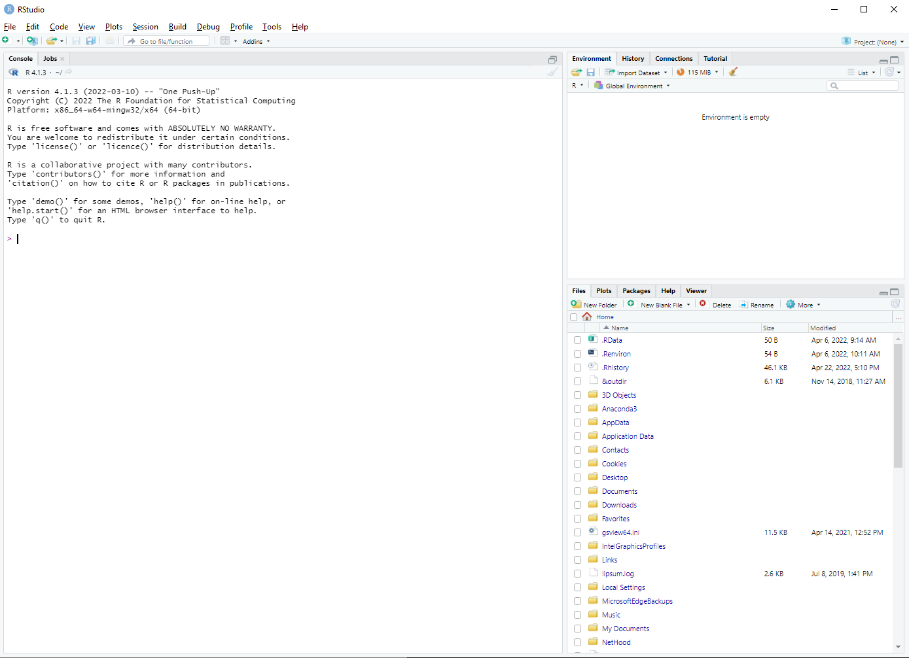
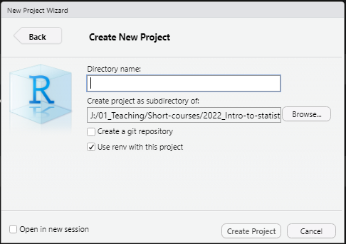

```{r setup, include=FALSE}
knitr::opts_chunk$set(echo = TRUE)
```

This practical assumes R and RStudio have already been installed in your computer.

# Create an R Project

## Open RStudio

```{r out.width="100%", fig.align='center', echo=F}

```

## Create an R Project

Go to **File** > **New Project**...  
Select **New Directory**  
Then, select **New Project**  
**Create New Project:**

```{r out.width="75%", fig.align='center', echo=F}

```

- Find a suitable parent directory to create your project  
- For example, for this tutorial I have created a folder in the path `C:/path/to/file/2022_Intro-to-statistics`  
- For this practical, use `scripts` as **Directory name** (but note the name could be anything)
- Make sure the **Use renv with this project** box is ticked

You now have an RStudio project called **scripts**. On the background, RStudio created for you a folder called **scripts** in the directory you selected above (i.e. `C:/path/to/file/2022_Intro-to-statistics`).  

It also created a file called `scripts.Rproj` within this new folder (alongside with other very useful files you need not to worry about at the moment).  

You can find more information about RStudio projects [here](https://support.rstudio.com/hc/en-us/articles/200526207-Using-RStudio-Projects).  

***

# Create an R Script

Go to **File** > **New File** > **R Script**  

A new **pane** on the left hand side of the **RStudio** window should automatically appear. This is called the **source pane**. The tab on the top shows the name of the file, in this case the R Script you just created, which by default is called **Untitled1**.  

The **source pane** is effectively a basic text editor where you can type in your code in one (or multiple) script files.

Let's scribble a little note into our script that  gives us a hint about what this script is about.   

Type in:

``` {r}
# Practical 1 - Processing data
# This script contains basic data cleaning steps
# It also showcases how to do basic data exploration steps
```
**TIP**: The `#` sign is used to "comment out" annotations.
It is always good practice to leave notes to yourself (or others) about 
what your scripts do.  

Now, let's save the script:

- Go to **File** > **Save As...**  (notice RStudio automatically opens the newly created folder `scripts`)  
- Save this script as `01.practical-01.R`  

***Listo!*** You now have created an R Project called **scripts**, which holds an R script called `01.practical-01.R`.  

***

# Setup R packages

## What is an R package

R is great for multiple reasons. One of these reasons is its big community, which
is constantly expanding the applications and tools available for R users. These
tools are called packages (`r emo::ji("package")`) and they allow users to *call*
new functions which are then used for very specific (but powerful) tasks throughout
data processing and analysis. In this modern days, most of the R coders use several
packages for their work.  

You can read more about R packages here and this handbook for epidemiology
using R (which will be referenced multiple times throughout the practicals)
includes a comprehensive list of `r emo::ji("package")``r emo::ji("package")``r emo::ji("package")`
that are useful for epidemiological data analysis. This handbook is also a 
great source for self-paced learning of R for epidemiologists.  

## Installing R packages

Now, because this is only a very short introductory course, I am going to
ask you to trust me on these next steps as we will be cutting some corners.  

We are going to install a number of packages that we will need later on. To
facilitate the installation proces we are going to use a package whose main 
function is to help users install *other* packages `r emo::ji("exploding head")`. 
This package is called `pacman` (yes, R folk get very creative when naming their packages).  

Type in your R script the following (please feel free to copy-paste, to avoid typos):

```{r message=F}
if (!require("pacman")) install.packages("pacman")
```

All this does is check if **pacman** is already installed. If not, then it installs it.

> Now run it!

> `r emo::ji("face screaming in fear")``r emo::ji("face screaming in fear")`
`r emo::ji("face screaming in fear")` ***How do I run something in R?!?*** 

Select the text you just typed into the script and either:  

- Press `Ctrl`+`Enter`, or  
- Click **Run** on the header of the **source pane**  

I prefer the `Ctrl`+`Enter` option.  

You will notice that text appears on the bottom left **pane**: the **Console**
tab. This pane is where R tells you what it's going on. There, you will find the output 
of operations that you have requested to R. Error messages also appear here.  

In this particular case, the console should let you know that **pacman** has
been installed successfully.  

After being downloaded and installed, packages need to be loaded on each session
before they can be used for analyses. **pacman** helps with this process by 
checking if any package in a given list is installed or not (and if it isn't, 
it then installs it), and then loading such packages.  

So, use **pacman** to load the `r emo::ji("package")``r emo::ji("package")``r emo::ji("package")`
we will be using for this session.  

Run the following line:

```{r}
pacman::p_load(ggplot2, rio, here, janitor, skimr, forcats, lubridate, tidyverse)
```

You'll find out more about these packages throughout the practicals. However, 
one thing to bear in mind is that you only need to *load* these packages once
per R session. This means you need not to be constantly loading packages every
time you want to use them in your scripts.   

So, to recap, your RScript called `01.practical-01.R` currently looks like this:

```{r}
# Practical 1 - Processing data
# This script contains basic data cleaning steps
# It also showcases how to do basic data exploration steps

# Instal/Load pacman
if (!require("pacman")) install.packages("pacman")

# Instal/Load all other packages
pacman::p_load(ggplot2, rio, here, janitor, skimr, forcats, lubridate, tidyverse)
```

***

# Setup the training data for the session  

So, I imagine you hve already downloaded the dataset that was made available
for this practical (`practical-1.csv`) and, as per the instructions, you
saved this dataset in a folder called `data` in your `Desktop` (if not, this is the cue).  

The path to this file should look like this: `C:/User/Desktop/data/practical-1.csv`  

The next objective is to import o the training dataset into R.  

In real life, creating copies of large datasets and moving these data into other
directories will largely depend on the standards of information governance
and data security within institutions.  

For this practical, we want to have our training dataset within our
project directory in a folder called `/data`. There are two ways to do this 
and it really depends on how familiar you are with relative and absolute file-paths.  

## 1. Manually move the data and then import into R

### 1.1 Move dataset

1. Open your project directory `C:/path/to/file/2022_Intro-to-statistics` in your File Explorer  
2. Create a folder called `data`  
3. Save a new copy of the `practical-1.csv` dataset in the newly-created folder `data`  

### 1.2 Import to R

For this step, we are going to use two `r emo::ji("package")``r emo::ji("package")`: 
***rio*** and ***here***, which were installed and loaded before. These packages 
facilitate defining relative file paths and importing (and exporting) data. 
Additionally, they work nicely with RStudio projects.  

- [**rio**](https://cran.r-project.org/web/packages/rio/index.html) functions `import()`
and `export()` handle many different file types (.csv, .tsv, .xlsx)  

- [**here**](https://cran.r-project.org/web/packages/here/index.html) function `here()` allows description
of location of files in a given R project in relation to the project's *root directory*  

Let's see what they do:

Calling the function `here()` returns (to the **Console**) the file path to your
current **working directory**.   

```{r eval=T}
here()
```
Adding the arguments `"data"` and `practical-1.csv` return the file name of the
dataset.  

```{r}
here("data","practical-1.csv")
```

Let's then now use the function `import()` to open the dataset in
the filepath returned by the `here()` function and assign it to
the object `my_dataset`:  
```{r eval=F}
my_dataset <- import(here("data", "practical-1.csv"))
```

You are probably asking what an **object** is.  

Well, when instructed to, R treats any datum or data that we want 
to temporarily hold on to (for instance, to use for analyses) as an
**object**. 

The way to instruct R to do this y with the `<-` and in the form:

```{r eval=F}
x <- y
```

where `x` is the object being assigned whatever value `y` is (the result
returned by a function or another object, for example).

In this case, we are asking R to read the dataset `practical-1.csv` and
assign it to an object called `my_dataset` which will "live" in the 
R workspace (i.e. temporarily until the R session ends)  

## 2. Do it all with R

### 2.1 Import directly from original location
```{r eval=F}
my_dataset <- import("C:/User/Desktop/data/practical-1.csv")
```

#### 2.1 Export to folder within R project

##### 2.1.1 Create new folder with R  
**NOTE: this is an advanced feature that is not fundamental to learn for this course.**
R can create folders for you with the `dir.create` function, but the
directory must not exist. Therefore, it is best to ask R to
check if the directory exists *before* asking it to create it.  

This can be accomplished with the following:  
```{r eval=F}
if (file.exists(here::here("data"))) {
 cat("The folder already exists")
} 
else {
 dir.create(folder)
}
```

##### 2.1.2 Export to data folder
```{r eval=F}
export(my_dataset, here("data","practical-1.csv")) #CHECK THAT IT WORKS!
```


> Now were are ready to explore our data!

***

# 1. Data exploration: what's in this dataset?


Often, epidemiological data comes from **multiple sources**:  

- Questionnaire data from recruitment  
- Biological sample results  
- Linkage to clinical/mortality records 
  
  
How do data usually look like in `R`?

`R` is an object-oriented language where **objects** are anything
(constants, data structures, functions, graphs) that can be assigned
to a variable  

```{r out.width="100%", fig.align='center', fig.link="http://venus.ifca.unican.es/Rintro/dataStruct.html",echo=F}
knitr::include_graphics("img/R_data_structures.png")
```
