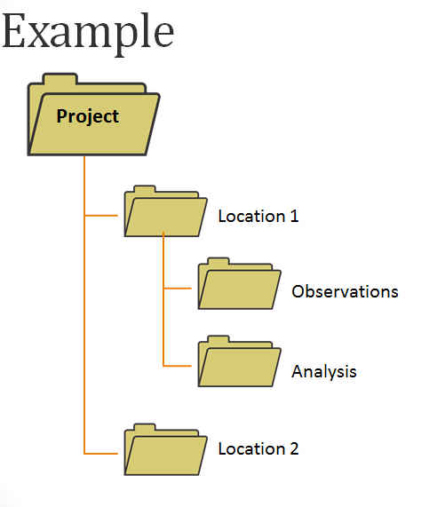
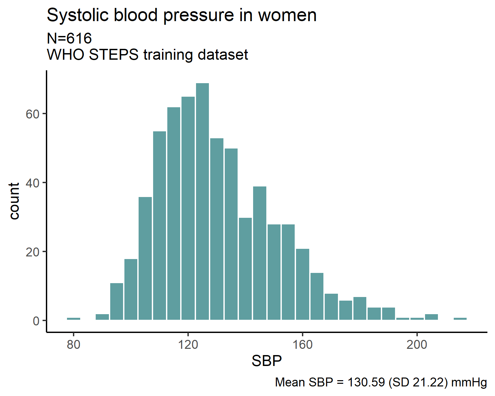

```{r setup, include=FALSE}
knitr::opts_chunk$set(echo = FALSE)
```
<!-- 
This is part of setup for footer and footnotes 
Scripts were extracted from: https://riptutorial.com/r/example/13950/adding-a-footer-to-an-ioslides-presentation
and: https://stackoverflow.com/questions/42690955/how-to-insert-footnotes-in-ioslides-presentations-using-rmarkdown
and: https://www.w3schools.com/cssref/pr_text_text-align.ASP

RMarkdown 2.0 cheatsheet here file:///C:/Users/diegoa/Downloads/rmarkdown-2.0.pdf
-->
<script src="https://ajax.googleapis.com/ajax/libs/jquery/1.12.2/jquery.min.js"></script>

<script>
    $(document).ready(function() {
      $('slide:not(.title-slide, .backdrop, .segue)').append('<footer label=\"Processing & Visualising Epidemiological Data\"></footer>');    
    })
</script>

<script>
$(document).ready(function() {
  $('slide:not(.backdrop):not(.title-slide)').append('<div class=\"footnotes\">');

  $('footnote').each(function(index) {
    var text  = $(this).html();
    var fnNum = (index+1).toString();
    $(this).html(fnNum.sup());

    var footnote   = fnNum + '. ' + text + '<br/>';
    var oldContent = $(this).parents('slide').children('div.footnotes').html();
    var newContent = oldContent + footnote;
    $(this).parents('slide').children('div.footnotes').html(newContent);
  });
});
</script>

<style>
  footer:after {
    content: attr(label);
    font-size: 10pt;
    position: absolute;
    bottom: 20px;
    left: 40%;
    line-height: 1.9;
  }
</style>

<style>
div.footnotes {
  position: absolute;
  bottom: 0;
  margin-bottom: 80px;
  width: 80%;
  font-size: 10pt;
}
</style>

```{r packages, echo=FALSE}
if (!require("pacman")) install.packages("pacman")
if (!require("emo")) devtools::install_github("hadley/emo")
pacman::p_load(devtools, gifski, ggplot2, tidyverse, rio, here, emo)
```

## Learning objectives {.build}

- Familiarize with **workflow** concept for data processing  
- Understand the **importance** of cleaning data  
- Learn **basic preparation steps** for data analyses (with a statistical perspective)  
- Consider **ethical implications** of data cleaning  

## The *workflow* in Data Science<footnote>From R for Data Science: https://r4ds.had.co.nz/index.html</footnote>

```{r out.width="100%", fig.align='center', fig.link="https://r4ds.had.co.nz/introduction.html", echo=F}
knitr::include_graphics("img/data-science-wf.png")
```

## Why is data cleaning needed? {.build}

```{r out.width="75%", fig.align='center', fig.link="https://eastneukanalytics.com/2020/01/26/how-confident-are-in-your-data", echo=F}
knitr::include_graphics("img/rubbish-in-rubbish-out-2.png")
```

- Errors occur (despite *all*)  
- Good Scientific/Clinical Practice  

## What *is* data cleaning? {.smaller}
**Ensuring** that data are suitable for analysis  

Data cleaning usually involves (cycles of):  

  - **Organising data (& other files)**   
  - **Loading and merging**   
  - **Understanding and formatting**   
  - **Deduplicating**   
  - **Transforming **  
  - **Selecting**  
  
```{r out.width="50%", fig.align='center', fig.link="https://epirhandbook.com/en/cleaning-data-and-core-functions.html", echo=F}
knitr::include_graphics("img/data_cleaning.png")
```

## Organising data & other files {.smaller}
A clear nomenclature for file names is essential to avoid errors<footnote>https://datamanagement.hms.harvard.edu/collect/file-naming-conventions</footnote>  

```{r fig.link="https://xkcd.com/1459", out.width="25%", fig.align='center', echo=FALSE}
knitr::include_graphics("img/filenames.png")
```

## Organising data & other files {.smaller}

Have a clear nomenclature for file names:  

- **No spaces**  
- **No special characters** (`.`,`-` or `_`)  
- **Self-descriptive**  
- **Embed logic**  

**Examples**:  

- No naming convention:  
`FINAL_script__clean-survey Mexico City 2015.R`  

- Naming convention:  
`01.1_merge-survey-data_MC-2015.R`    
`01.2_clean-survey-data_MC-2015.R`     
`02.1_main-analyses_MC-2015.R`    
`02.2_sens-analyses_MC-2015.R`    
`03.1_make-figures_MC-2015.R`   
`03.2_make-tables_MC-2015.R`    
 
## Organising data & other files
```{r fig.link="https://libguides.princeton.edu/c.php?g=102546&p=930626", out.width="50%", fig.align='center', echo=FALSE}

```

## Organising data & other files {.smaller}

**Consistency** and **logic** are key!  

- Facilitate finding files  
- Faster coding  
- Easy to read for others  

**Example:** all my `~/my_project/` folders tend to have my R scripts in the root folder and have (at least) 3 sub-folders:  

- `~/my_project/data/`  
- `~/my_project/output/`  
- `~/my_project/manuscript/`

<div class="red2">
**IMPORTANT!**  
</div>
- **Never** work over raw data files  
- Define/locate directory(s) where raw data file(s) will be stored and consider working with copies of such files  

## Organising data & other files
<div class="red2">
**SOLUTION!**
</div>
Use **R Project**<footnote>https://epirhandbook.com/en/r-projects.html</footnote>   

- Enables work in a self-contained folder  
- Keeps all scripts, data files, outputs, and history in sub-folders  
- The *working directory* is the project's root folder  

More on practical...  

## Loading and Merging data {.smaller}

**Loading data into R**:  

The R `r emo::ji("package")` **here** and **rio** facilitate defining relative file paths and importing (and exporting) data (work nicely with R Projects)  

- [**rio**](https://cran.r-project.org/web/packages/rio/index.html) functions `import()` and `export()` handle many different file types (.csv, .tsv, .xlsx)  

- [**here**](https://cran.r-project.org/web/packages/here/index.html) function `here()` allows description
of location of files in a given R project in relation to the project's *root directory*  

Instead of having to do:
```{r, eval=F, echo=T}
my_dataset <- import("C:/User/path/to/R-project-folder/data/steps-training-data.csv"))
```

A combination of both **rio** and **here** would look like this:
```{r, eval=F, echo=T}
my_dataset <- import(here("data", "steps-training-data.csv"))
```
## Loading and Merging data {.smaller}
Often, epidemiological data comes from **multiple sources**:  

- Questionnaire data from recruitment  
- Biological sample results  
- Linkage to clinical/mortality records 
  
  
How do data usually look like in `R`?

`R` is an object-oriented language where **objects** are anything
(constants, data structures, functions, graphs) that can be assigned
to a variable  

```{r out.width="35%", fig.align='center', fig.link="http://venus.ifca.unican.es/Rintro/dataStruct.html",echo=F}
knitr::include_graphics("img/R_data_structures.png")
```

## Loading and Merging data 

Three main approaches to merging or joining datasets:  

- Common identifier

  - The function `left_join()` from the [**dplyr**](https://dplyr.tidyverse.org/) package is useful for merging based on common identifier (**more on practical**)  
  
- Probabilistic  
- Binding or appending  

## Understanding and formatting data  
**Data loaded!!!**  

So...what's up with this dataset?  

Have a quick look!  

- **Skim** package to see what the data looks like  
- May want to 'have a look' *before* merging different datasets

## Understanding and formatting data  
**Types of variables in epidemiology**  

- Continuous (numerical or integer)  
- Categorical (factors, **forcats**)  
- Dates (**lubridate**)  
- Character (**stringr**, **glue**)  

## Deduplicating data
Occasionally, rows might be duplicated:  

- Computer glitch/input error when capturing data (e.g. exact same rows including ID, or exact rows *except* ID)  
- Participants recruited/surveyed twice  
- Multiple events or measures for same individual (more careful management)  

## Transforming data
<div class="red2">
**Consider the following scenario**
</div>
Does SBP vary in men and women?  

```{r out.width="75%", fig.align='center', echo=F}

```

Can **'untidy'** data affect analyses?  

## Transforming data
**Usually influenced by statistical concepts**  

1. Implausible values  
2. Extreme values or outliers  
3. Inconsistent values  
4. Transforming and recoding variables  

## Transforming data
<div class="red2">
**Implausible values**
</div>

Values that could not possible be true  

- SBP of 220 mmHg is *unusual* but possible  
- SBP of 540 mmHg is is *physiologically impossible*  

Recording error?  

If not able to find *true* value, set as missing  

## Transforming data
<div class="red2">**Implausible values**</div>  

*Before data cleaning*

```{r out.width="60%", fig.align='center', echo=F}

```


## Transforming data
<div class="red2">**Implausible values**</div>  

*After data cleaning*
```{r out.width="60%", fig.align='center', echo=F}

```

## Transforming data
<div class="red2">
**Implausible values**
</div>
Does SBP vary in men and women?  

```{r out.width="75%", fig.align='center', echo=F}

```


## Transforming data
<div class="red2">
**Extreme values or "outliers"**
</div>  

- Values outside the *usual* range for the variable  
  - But values are plausible  
- Judgement call (*subjective*)  
  - Define cut-offs  
- Inspect distributions first  

## Transforming data
<div class="red2">**Extreme values or "outliers"**</div>  
```{r out.width="75%", fig.align='center', echo=F}

```


## Transforming data
<div class="red2">**Extreme values or "outliers"**</div>  
```{r out.width="75%", fig.align='center', echo=F}

```


## Transforming data
<div class="red2">**Extreme values or "outliers"**</div>  
\
```{r out.width="75%", fig.align='center', fig.link="https://lsc.studysixsigma.com/wp-content/uploads/sites/6/2015/12/1435.png", echo=F}
knitr::include_graphics("img/boxplot.png")
```

<!-- The "dots" at the end of the boxplot represent outliers. There are a number of different rules for determining if a point is an outlier, but the method that R and ggplot use is the "1.5 rule". If a data point is: -->

<!-- less than Q1 - 1.5*IQR -->
<!-- greater than Q3 + 1.5*IQR -->
<!-- then that point is classed as an "outlier". The whiskers are defined as: -->

<!-- upper whisker = min(max(x), Q_3 + 1.5 * IQR) -->

<!-- lower whisker = max(min(x), Q_1 - 1.5 * IQR) -->
## Transforming data
<div class="red2">
**Implausible values**
</div>
Does SBP vary in men and women?  

```{r out.width="75%", fig.align='center', echo=F}

```

## Transforming data 
<div class="red2">**Extreme values or "outliers"**</div>  
\
- Certain statistical tests are unduly influenced by outliers  
- Removing these values requires careful consideration  
\
<div class="centered">**What are the possible issues with this approach?**</div>  
\
If values plausible:  
\
- Would omit information from analyses  
- Limits generalisability of results  
- Could look like 'fixing' your data  
\
**If extreme values removed, this need to be clearly documented
and reported (justify decision)**  

## Transforming data
<div class="red2">**Inconsistent values**</div>  

## Transforming data
<div class="red2">**Coding issues**</div>  

## Transforming data
<div class="red2">**Transforming and recoding variables**</div>  

## Selecting data

```{r echo=FALSE}
set.seed(1990)
bp <- data.frame(
  sex=factor(rep(c("Women","Men"), each=400)),
  sbp=round(c(rnorm(400, mean=130, sd=20), rnorm(400, mean=140, sd=20)))
)
```

```{r}
summary(bp)
```

```{r}
ggplot2::ggplot(bp, aes(x=sbp)) + 
  ggplot2::geom_histogram()
```


## Slide with a table
|Right|Left|Default|Centre|
|----:|:---|-------|:----:|
|12|12|12|12|
|123|123|123|123|
|1|1|1|1|

## Slide with Animation
```{r, animation.hook='gifski'}
for (i in c(100,1000,10000,100000,1000000)) {
  ggplot()
  #pie(c(i %% 2, 6), col = c('red', 'yellow'), labels = NA)
}

bp <- data.frame(
  sex=factor(rep(c("Women","Men"), each=200)),
  sbp=round(c(rnorm(200, mean=130, sd=20), rnorm(200, mean=140, sd=20)))
)
```
## What *is* data cleaning?

Conceptually:  
```{r out.width="50%", fig.align='center', fig.link="https://journals.plos.org/plosmedicine/article?id=10.1371/journal.pmed.0020267", echo=F}

```

## Ethical considerations of data cleaning
>*"Data cleaning can* ***never*** *be a cure for poor study design or study conduct. Concerns about where to draw the line between* ***data manipulation*** *and* ***responsible data editing*** *are legitimate. Yet all studies, no matter how well designed and implemented, have to deal with errors from various sources and their effects on study results."*

>*"...description of data cleaning"* should *"be a standard part of reporting statistical methods."*
<footnote>[@broeck2005]</footnote>

## Reproducible Research
Replication is hard, but necessary for better science!  

Scripting **everything** is essential for reproducible research.  

```{r out.width="60%", fig.align='center', fig.link="https://rstudio-pubs-static.s3.amazonaws.com/157089_504d61c69ada43e8b9f67a0979d43c48.html", echo=F}

```

## Sources for learning R
- The Epidemiologist R Handbook<footnote>https://www.repidemicsconsortium.org/</footnote>
- R4epis<footnote>https://r4epis.netlify.app//</footnote>
- RECON: The R Epidemics Consortium<footnote>https://www.repidemicsconsortium.org/</footnote>

## Sources for creating Rmd slides

- https://bookdown.org/yihui/rmarkdown/ioslides-presentation.html

<!-- For practical -->

## Bibliography
